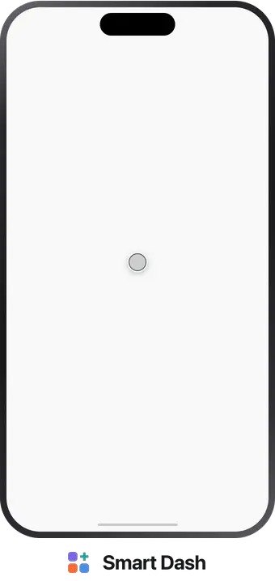

# Smart Dash — Community

**Live dashboards for any device or API.** Smart Dash turns HTTP, WebSocket, SSE, Socket.IO, MQTT
and Bluetooth Low Energy data into live dashboard widgets on your phone — no code, works offline,
no account needed.

<!-- GitHub resolves prefers-color-scheme from the reader's own GitHub theme, so
     each visitor gets the one that matches the page they are already on. The two
     files are not interchangeable: each carries the wordmark ink for its own
     background, and both are transparent. -->

  <picture>
    <source media="(prefers-color-scheme: dark)" srcset="media/build-flow-dark.webp">
    
  </picture>

<!-- Plain platform glyphs, not Apple's "Download on the App Store" or Google's
     "Get it on Google Play" artwork: those are licensed for linking to a live
     listing. Swap in the official badges, as links, once both are published. -->

  
  &nbsp;&nbsp;
  

A source, a tag, a widget, and a dashboard reading live data — that is the whole model.
[Read how it works](https://getsmartdash.com/docs/core-concepts/source-tag-widget).

- Website: <https://getsmartdash.com>
- Docs: <https://getsmartdash.com/docs>
- Quick Start (5 minutes, no hardware): <https://getsmartdash.com/docs/introduction/quick-start>
- Troubleshooting & FAQ: <https://getsmartdash.com/docs/troubleshooting>
- Blog: <https://getsmartdash.com/blog>

> **This repository has no source code.** Smart Dash is closed-source. This repo is a public space
> for the community — questions, ideas, and things you've built with Smart Dash — and it powers
> comments on the [blog](https://getsmartdash.com/blog) via GitHub Discussions.

For account or billing help, email **support@getsmartdash.com** — that's the guaranteed channel.
Everything below is optional: a place to talk with other users and, if you feel like it, help us
make Smart Dash better.

---

## Ask a question or share something

Use **[Discussions](../../discussions)**:

| Category | For |
|---|---|
| **Q&A** | "How do I…" / "Why doesn't…" questions. Mark the reply that solves it. |
| **Ideas** | Feature ideas that aren't quite a formal request yet — discuss before filing an issue. |
| **Show and tell** | Dashboards, sensor setups, integrations you've built. |
| **General** | Anything else Smart Dash related. |
| **Announcements** | Release notes and project news — posted by the team. |
| **Blog** | Auto-populated by comments on [blog posts](https://getsmartdash.com/blog). Don't post here directly. |

## Found a bug, or have a feature in mind?

If you'd like to help us improve Smart Dash, open an **[Issue](../../issues/new/choose)** and pick
a template:

- 🐛 **Bug report** — something is broken or not behaving as documented.
- ✨ **Feature request** — a new capability or improvement.

Not required, just appreciated — search existing issues first, and one issue per report keeps
things easy to track.

---

## Guidelines

- Be respectful — this is a public space for users, not just developers.
- Search before posting, in both Issues and Discussions.
- The more detail (steps to reproduce, screenshots, app version, device/OS), the faster we can help.
